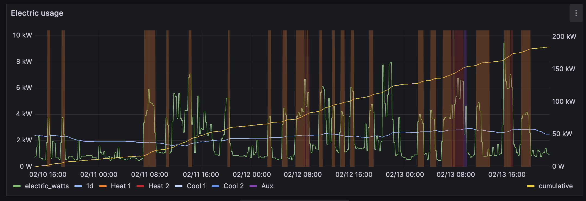

# electric-usage-downloader

This project reverse engineers the [NISC SmartHub](https://www.nisc.coop/blog/beyond-the-bill-the-power-of-smarthub/)
api, which is used by hundreds of utility co-ops throughout the United States. This allows
downloading 15-minute resolution electic usage and cost data for your personal account if you have a smart meter.

In prior versions of SmartHub, it was possible to download CSV exports of 15-minute interval usage data by
specifying an "hourly" interval, but since January 2024 only hourly data has been available via CSV. That's
why I reverse engineered the API instead of automating a download of the CSV as I had previously done.

Data can be imported into InfluxDB or VictoriaMetrics.

## Config

Download [config.example.yaml](config.example.yaml) and fill in your own values.

- `extract_days` is how many days to look back from the current day. Max is 45.
  if specific `--start` and `--end` flags are not specified.
- `account` is your account number, available on your bill and on the SmartHub website.
- `service_location` is an internal SmartHub number, and must be retrieved from your browser:
  - Open the Developer tools to the Network tab
  - Navigate to Usage Explorer (example: https://novec.smarthub.coop/ui/#/usageExplorer)
  - Find a call to `services/secured/utility-usage/poll` in the Network tab
  - Open the call, and copy the `serviceLocationNumber` field from the Payload tab.
- `timezone` needs to be set to the timezone used by your utility. For some reason,
  the SmartHub API decided to return unix timestamps, but in the utility's timezone
  instead of in UTC, which would be the normal choice for an API.
- `influxdb.insecure` allows connecting to a server with certificate issues.
- The other fields should be fairly self-explanatory.

## Running

- To download and insert the last `extract_days`, run like this arguments: `electric-usage-downloader --config config.yaml`
- To download and insert a specific date range, run with arguments: 
  `electric-usage-downloader --config config.yaml --start 2024-01-16 --end 2024-01-17`
- The `--debug` flag can be used to log responses from the API for assistance debugging issues.

## Details

The SmartHub api currently supports 15-minute resolution of data. This could change in the future; 15-minute interval
usage data used to be available via CSV export, but that ability was removed in January 2024.

Measurement: **electric**

Fields:
- **cost** (in US cents)
- **usage** (in watts)

## Dashboard

I have included my [Grafana dashboard panel definition](dashboard/panel.json) in the repo.

Features:
- Electric usage graphed in watts
- Trailing 1d and 7d averages
- Cumulative usage (right x axis)
- Integrated with data from my Ecobee thermostat, showing when my heat pump or aux oil heat is running.
  - See https://github.com/tedpearson/ecobeemetrics for how I get this data

Here's a screenshot of the dashboard panel in action:
